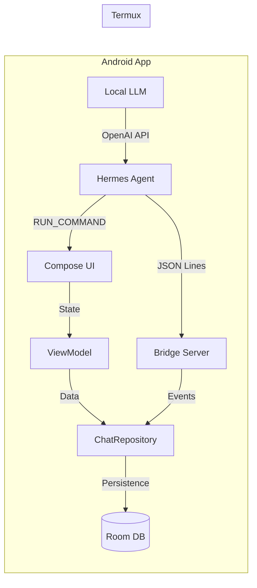

# LocalAgent Technical Overview

LocalAgent is an Android "Sidecar" application for the **Hermes Agent**. It provides onboarding, structured **Compose** UI with rich assistant markdown, persistence, credential/provider management, encrypted terminal (termlib), and on-device GGUF inference, while Hermes executes in **Termux** behind **`RUN_COMMAND`**.

Companion doc: **[README.md](README.md)** (user-facing capabilities and build commands). Documentation hub: **[docs/README.md](docs/README.md)**.

---

## Major UI surfaces (Compose)

| Route / flow | Responsibility |
|----------------|----------------|
| **Onboarding** | DataStore-backed steps; **`AppContainer.completeOnboarding()`** persists dismissal. |
| **Hermes / setup** | **`HermesSetupCoordinator`** + **`HermesBootstrapCoordinator`**: manifest-driven installer fetch, Termux scripting, bridge var copy/regen, **`HermesEnvWriter`**. |
| **Local model** | Catalog + download + **`LocalLlmService.bootstrapBundledQwenLocalFirst`**: pinned catalog entry **`ModelDownloadManager.download`**, **`OpenAiRoutingStore.Mode.LOCAL_FIRST`**, **`loadModel`**, **`startHttpServer`**, **`syncFromVault`**. On success, **`TermuxRunCommand.pushHermesDotEnvStdin`** when Termux installed + **`hasRunCommandPermission`**. |
| **Chat** | **`ChatRoute`** backed by **`ChatRepository`**; **`/model`**, **`/skills`** meta handlers; **`AssistantMarkdown`** for assistant bubbles. |
| **Providers / keys** | Vault snapshot + presets; merges into **`HermesEnvWriter.mergedDotEnvContent`**. **Google OAuth (Gemini OpenAI-compatible base)** when `BuildConfig.GOOGLE_OAUTH_CLIENT_ID` set; **`INTERNAL_KEYS`** (`OAUTH_*` flow state) never exported to `.env`. |
| **Settings** | Synthetic HOME path; **Wi‑Fi-only bridge/LLM** policy (`DataStore` → `BridgeSocketServer.restart` + `LocalLlmService.refreshHttpAfterNetworkPolicy`); **bridge diagnostics** timeline. |

Navigation wiring lives under **`MainActivity`** / **`ui/`** navigation graph (single-activity).

---

## Assistant markdown subsystem

Rendered in Compose for assistant messages (**`AssistantMarkdown.kt`**):

- **CommonMark** parsing with **table** support (GFM-flavored extensions as configured in the markdown dependency stack).
- **Fenced code**: monospace **`Text`** in a **`Card`**; **`LocalClipboardManager`** + copy **`IconButton`** → toast/snackbar strings **`markdown_*`**.
- **Inline and display math**: embedded **`AndroidView`** **`WebView`** loads HTML with **`file:///android_asset/katex/`** base URL; **`katex.min.css`**, **`katex.min.js`**, and font files ship under **`assets/katex/`** (fully offline).

**Trade-offs:** `WebView` introduces process memory and sync cost per math fragment; **`allowFileAccessFromFileURLs`** is required for asset-relative KaTeX and is flagged deprecated — suppressed at the composable boundary with explicit security posture (base URL confined to **`katex/`**, no arbitrary URL loading).

---

## Architecture (runtime)

The system consists of three main components:

1.  **LocalAgent (Android App):** The UI host, Room database for persistence, and local LLM server.
2.  **Hermes Agent (Termux):** The core intelligence, executing in a POSIX-like environment with full access to shell tools.
3.  **Bridge Protocol:** A JSON-over-TCP stream that links the two across UID boundaries.

## Bridge Protocol Spec

The bridge server listens on TCP port **17852** (configurable).

### 1. Handshake (Auth)
The client must eventually send a non-empty line of the form `AUTH <LOCALAGENT_BRIDGE_TOKEN>` (leading / trailing ASCII whitespace trimmed on each line read). **`readLine`-empty lines before AUTH are skipped** so Hermes clients may preamble with blanks. If the first non-empty line is not a valid AUTH line, or the token does not **`MessageDigest`-equal** the configured bridge token (**`Hermes`** / **`CredentialVault`**), the server records a failed attempt (for IP rate-limiting) and closes the connection. On success, subsequent lines are parsed as JSON **`BridgeEvent`** payloads.

### 2. Event Format
Events are newline-delimited JSON objects.
Common event types:
- `session`: New chat session started (contains `id` and `title`).
- `user`: Message sent by the user.
- `assistant_delta`: Partial response chunk from the agent.
- `assistant_done`: Signals completion of an assistant response.
- `tool`: Information about a tool execution (name, status).
- `approval`: Pending human approval (`promptId`, `command`). Persisted with approve/deny wired to Termux `hermes approve|deny`.
- `usage`: Optional usage metadata (`model`, token counts).

Optional **`sessionId`** on non-`session` events routes persistence to that thread even when another session is selected in the UI (omit/null falls back to the active session).

## Bridge diagnostics

`BridgeSocketServer` exposes **`diagnostics`**: a `SharedFlow` of **`BridgeDiagEvent`** (timestamp, kind, message). Kinds include `bind`, `wait_wifi`, `tcp_connect`, `auth_ok`, `auth_failed`, `auth_malformed`, `json_parse`, `disconnect`, `wifi_lost`, `auth_rate`, etc. UI: Settings screen with a modest replay buffer plus live events and copy; Hermes tab **activity log** mirrors recent diag + Termux results. **`disconnectAllClients()`** closes accepted bridge sockets without stopping the listener.

When **Wi‑Fi-only** policy is enabled (`AppContainer.setBridgeWifiOnly`), the accept loop **does not bind** until `DeviceIpv4.isActiveTransportWifi`; active listener closes when Wi‑Fi drops mid-session.

---

On **`LOCALAGENT_LLM_HTTP_PORT`** (default **17853**), LocalAgent exposes a minimal OpenAI-style API:

- `GET /v1/models`
- `POST /v1/chat/completions` with optional **`stream: true`** (SSE `data:` chunks).

All routes require **`Authorization: Bearer <LOCAL_LLM_HTTP_BEARER>`** (persisted in encrypted prefs + merged `.env`). Plain TCP without TLS — treat like bridge traffic on LAN.

Inference uses the same chat markers as `ChatPromptFormatter` (Qwen-style instruct template). JNI sampling rebuilds temp / top‑p / dist each completion (no global C++ mutex); Kotlin serializes concurrent requests.

Auto-load of last GGUF also starts the HTTP server when restore succeeds.

### Env merge routing (`OpenAiRoutingStore`)

`HermesEnvWriter.mergedDotEnvContent` applies one of three modes (persisted in `SharedPreferences`, surfaced from Chat **`/model`**):

| Mode | Behavior |
|------|----------|
| **DEFAULT** | `HermesBridgeEnv.build()` seed, then vault/provider snapshot overrides (prior behavior). |
| **LOCAL_FIRST** | Same merge order as DEFAULT (`HermesBridgeEnv` then vault); **`OPENAI_BASE_URL`**, **`OPENAI_API_BASE`**, **`OPENAI_API_KEY`** always overwritten with on-device llama HTTP + Bearer-as-key. |
| **VAULT_FIRST** | Only **`LOCALAGENT_*`** + **`LOCAL_LLM_HTTP_BEARER`** from bridge seed; vault supplies **`OPENAI_*`** / **`CUSTOM_*`** keys. |

## Termux Integration (IPC)

LocalAgent communicates with Termux using the `com.termux.RUN_COMMAND` intent.

**Working directory:** Termux applies `RUN_COMMAND_WORKDIR` with `java.io.File` (no shell tilde expansion). LocalAgent uses **`/data/data/com.termux/files/home`** — not `~/`, which breaks background installs.

### Intent payload

- **Action:** `com.termux.RUN_COMMAND`
- **Extra `RUN_COMMAND_PATH`:** Path to the executable (e.g., `/data/data/com.termux/files/usr/bin/hermes`).
- **Extra `RUN_COMMAND_ARGUMENTS`:** Array of strings (e.g., `["chat", "Hello world"]`).
- **Extra `RUN_COMMAND_BACKGROUND`:** `true` for silent execution, `false` to open a terminal.

This allows the Android UI to trigger Hermes actions without needing a direct reverse-socket connection.

Merged **`~/.hermes/.env`** uses **`pushHermesDotEnvStdin`**. Sandbox skill files under **`HermesPaths.hermesRoot/skills`** can be mirrored into Termux **`~/.hermes/skills`** with **`pushSandboxSkillsStdin`** (bounded stdin script built by **`SandboxSkills.buildTermuxPushScript`**).

## Local LLM Tuning

On-device inference uses `llama.cpp` JNI bindings. Performance depends heavily on NDK/CMake configuration and runtime parameters:

- **nGpuLayers:** Defaults to **`0`**. Optional **experimental GPU offload** (Local screen toggle) picks **`LlamaGpuLayers.suggestedOffloadLayers()`** (`arm64-v8a` / `x86_64` heuristics); explicit **`loadModel(..., nGpuLayers = …)`** still wins over prefs.
- **nThreads:** Ideally set to the number of "big" cores on the CPU (e.g., `4` on many modern SoCs) to avoid thermal throttling.
- **nCtx:** Context window size. Larger values consume significantly more RAM. 4096 is standard for mobile.

**GGUF downloads (`ModelDownloadManager`)**

- **Pinned SHA-256**: delete any **`*.part`**, stream one GET, hash verify, rename — no parallel segments (deterministic artifact).
- **Unpinned resume**: if **`*.part`** exists and **`length()` > 0**, always **`downloadResumable`** (single connection, **`Range`** / **`206`**, **`416`** handling as implemented).
- **Unpinned cold start**: **`probeParallel`**
  - GET with **`Range: bytes=0-0`**: if **`206`**, parse **`Content-Range`** total; body discarded safely.
  - If not **`206`** (servers that ignore **`Range`** and return **`200`**), **`discardBounded`** caps read so the probe cannot pull an entire GGUF.
  - HEAD fallback for **`Accept-Ranges: bytes`** and **`Content-Length`** when the ranged probe cannot establish length.
  - Requires **`acceptRanges`** and **`contentLength`** ≥ **`8 MiB`**: **`downloadParallel`** with **`parts = clamp(contentLength / 4MiB, 2..8)`** coroutine **`async`** segment writes to temp segment files merged into **`*.part`**. Any failure **`tmp.delete()`** + **`downloadResumable`** fallback.

**Connection pool** size increased (12 idle) for parallel segments; read timeouts are generous for CDN behavior.

---

## Native Inference (llama.cpp)

LocalAgent uses a custom JNI bridge to **`llama.cpp`** for high-performance, on-device inference.

### Hardware Acceleration
*   **ARM Dot Product (`dotprod`)**: Optimized for modern Android chips (e.g., Snapdragon 8 Gen 2/3). The build system explicitly enables `-march=armv8.2-a+dotprod` to leverage dedicated matrix multiplication instructions.
*   **Threading**: Automatically scales based on device core count (typically 4-8 threads) to balance speed and power consumption.

### Streaming Architecture
The inference engine supports **true real-time streaming**:
1.  **JNI Callback**: The C++ layer invokes a Java lambda for every generated token.
2.  **Ktor EventStream**: The internal OpenAI-compatible server streams these tokens directly to the **Hermes Agent** via Server-Sent Events (SSE).
3.  **UI Integration**: Chat messages are updated incrementally, providing immediate feedback to the user.

---

## Build System: Hybrid Strategy (Termux)

To support advanced Android APIs (35+) and complex NDK builds on-device, LocalAgent employs a **Hybrid Build Strategy**:
*   **Native AArch64 Environment**: Gradle and Kotlin compilation run natively in Termux for maximum speed.
*   **QEMU-Wrapped Toolchain**: The official Google `x86_64` `aapt2` binary is used via `qemu-user-x86-64` to handle resource linking for newer SDK versions that the native Termux `aapt2` build doesn't yet support.
*   **Proot-Distro Library Prefix**: A small Debian container provides the `glibc` libraries required by the `x86_64` build tools, mapped via `QEMU_LD_PREFIX`.

---

## Persistence

Chat history is stored in a Room database with two main tables:
- `chat_sessions`: Metadata for conversation threads.
- `chat_messages`: Individual message entries with role and timestamp (`approvalPromptId` set when the bridge emitted `approval`).

The `ChatRepository` ensures that streaming `assistant_delta` events are merged and persisted as a single message upon `assistant_done`.

Instrumented **`ChatRepositoryAndroidTest`** verifies **`BridgeEvent.UserMessage.sessionId`** routes persistence independently of the UI-selected active session.

---

## Known gaps, risks, and improvement backlog

Prioritized for engineering planning (not exhaustive):

| Priority | Topic | Notes |
|----------|--------|--------|
| **Security / trust** | **No TLS** on bridge or LLM HTTP | LAN-plaintext design; Hermes trusts bearer + bridge token. Future: optional mTLS, pinned device cert, or loopback forwarding proxy if Android networking model allows. |
| **Hardening** | **CDN / MIME edge cases** | Parallel path assumes **`Content-Length`** stable across segment GETs; some mirrors mis-report — fallback exists but could log metrics. |
| **DX** | **Deprecation cleanup** | `LocalClipboardManager` → **`LocalClipboard`** suspend API; **`WebSettings` file URL** deprecations — track WebView/Chromium guidance. |
| **Quality** | **Download tests** | Unit/integration tests mocking OkHttp **`MockWebServer`** for **`206`** / **`200`** misuse / parallel merge (today verified by manual + compile). |
| **Product** | **i18n & a11y** | Strings centralized; TalkBack audits on **`CodeCard`** / sliders / **`WebView` math**. |
| **Release** | **Signing, R8, Play policy** | Wire **`release`** minify templates, **`lintVitalRelease`**, store listing copy for **`RUN_COMMAND`** + Termux GitHub sourcing. |
| **Performance** | **Math WebView churn** | Pool or **`remember`** heavy KaTeX views; evaluate single shared **`WebView`** with JS bridge batching if message lists grow. |
| **UX** | **Hermes activity log** | Hermes tab surfaces Termux **`RUN_COMMAND`** stderr/stdout and bridge **`diagnostics`** (see also **`LocalAgentTermux`** logcat). Further polish: richer history / export. |
| **Product** | **Selectable bind interface** | Today: all-interfaces vs Wi‑Fi-only; per-interface (tun/hotspot) not yet exposed. |

When closing a gap, update **README** user-facing bullets and this section so onboarding and operators stay aligned with behavior.

